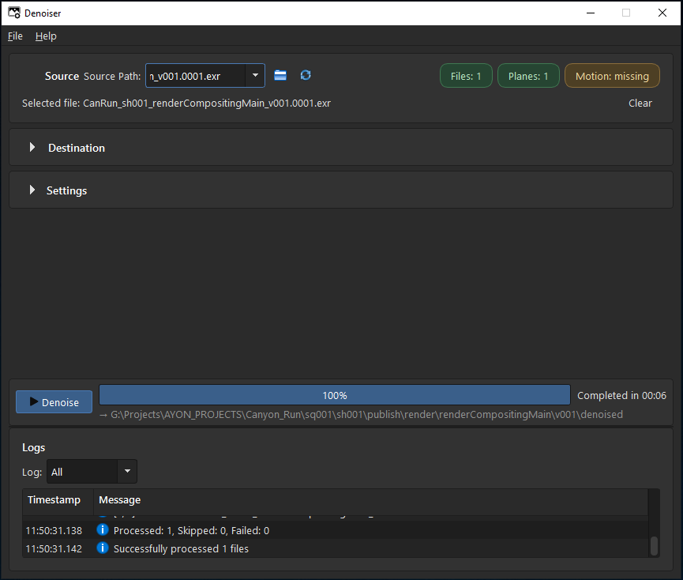

# h_denoise_utils

Standalone EXR denoising for artists and pipeline users.

[](https://github.com/Ahmed-Hindy/h_denoise_utils/actions)
[](https://www.python.org/downloads/)
[](LICENSE)



## What It Does

- Denoises OpenEXR image sequences.
- Denoises most AOVs.
- Supports bundled OptiX and Intel OIDN denoiser.
- Does not require Houdini.

## Download

For most users, download the latest Windows package from
[Releases](https://github.com/Ahmed-Hindy/h_denoise_utils/releases).

Look for:

```text
h-denoise-bundled-windows-x64-vX.Y.Z.zip
```

Unzip it, then run the included app.

## Run From Source

```bash
git clone https://github.com/Ahmed-Hindy/h_denoise_utils.git
cd h_denoise_utils
uv sync --extra pyside6
uv run h-denoise
```

If you prefer another Qt binding, use `--extra pyside2` or `--extra pyqt5`.

## Command Line

```bash
uv run h-denoise /path/to/renders --backend optix --optix-version 9.0
uv run h-denoise /path/to/input.exr --backend oidn
```

## More Help

- [Getting started](docs/getting-started.md)
- [Common tasks](docs/common-tasks.md)
- [Release package details](docs/release-variants.md)
- [Troubleshooting](docs/troubleshooting.md)

## License

[MIT](LICENSE)
